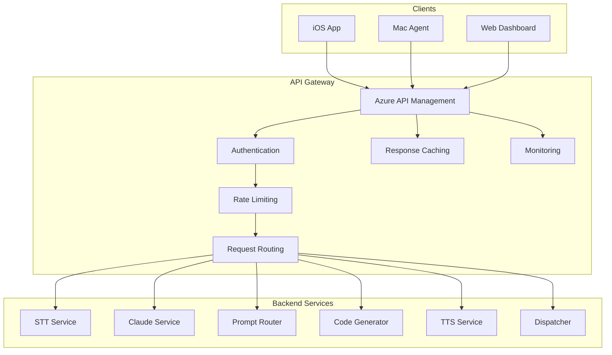

# VoiceCode API Gateway Specification

## Overview

The VoiceCode API Gateway serves as the single entry point for all client requests, providing authentication, rate limiting, request routing, and monitoring. Built on Azure API Management (APIM) for enterprise-grade features.

## Architecture

### Gateway Components



## API Specification

### OpenAPI Definition

```yaml
openapi: 3.0.1
info:
  title: VoiceCode API
  description: AI-powered voice assistant for code generation
  version: 1.0.0
  contact:
    name: VoiceCode Support
    email: support@voicecode.ai
servers:
  - url: https://api.voicecode.ai/v1
    description: Production
  - url: https://api-staging.voicecode.ai/v1
    description: Staging

paths:
  /voice/process:
    post:
      summary: Process voice command
      operationId: processVoiceCommand
      tags:
        - Voice
      security:
        - bearerAuth: []
      requestBody:
        required: true
        content:
          multipart/form-data:
            schema:
              type: object
              required:
                - audio
                - userId
                - sessionId
              properties:
                audio:
                  type: string
                  format: binary
                  description: Audio file (WAV, M4A, MP3)
                userId:
                  type: string
                  description: User identifier
                sessionId:
                  type: string
                  description: Session identifier
                language:
                  type: string
                  default: en-US
                  description: Language code
                context:
                  type: object
                  description: Additional context
      responses:
        '202':
          description: Accepted for processing
          content:
            application/json:
              schema:
                $ref: '#/components/schemas/ProcessingResponse'
        '400':
          $ref: '#/components/responses/BadRequest'
        '401':
          $ref: '#/components/responses/Unauthorized'
        '429':
          $ref: '#/components/responses/TooManyRequests'

  /code/generate:
    post:
      summary: Generate code from text
      operationId: generateCode
      tags:
        - Code
      security:
        - bearerAuth: []
      requestBody:
        required: true
        content:
          application/json:
            schema:
              $ref: '#/components/schemas/CodeGenerationRequest'
      responses:
        '200':
          description: Code generated successfully
          content:
            application/json:
              schema:
                $ref: '#/components/schemas/CodeGenerationResponse'
        '400':
          $ref: '#/components/responses/BadRequest'
        '401':
          $ref: '#/components/responses/Unauthorized'

  /status/{requestId}:
    get:
      summary: Get processing status
      operationId: getStatus
      tags:
        - Status
      security:
        - bearerAuth: []
      parameters:
        - name: requestId
          in: path
          required: true
          schema:
            type: string
      responses:
        '200':
          description: Status retrieved
          content:
            application/json:
              schema:
                $ref: '#/components/schemas/StatusResponse'
        '404':
          $ref: '#/components/responses/NotFound'

  /user/preferences:
    get:
      summary: Get user preferences
      operationId: getUserPreferences
      tags:
        - User
      security:
        - bearerAuth: []
      responses:
        '200':
          description: Preferences retrieved
          content:
            application/json:
              schema:
                $ref: '#/components/schemas/UserPreferences'
    put:
      summary: Update user preferences
      operationId: updateUserPreferences
      tags:
        - User
      security:
        - bearerAuth: []
      requestBody:
        required: true
        content:
          application/json:
            schema:
              $ref: '#/components/schemas/UserPreferences'
      responses:
        '200':
          description: Preferences updated

components:
  securitySchemes:
    bearerAuth:
      type: http
      scheme: bearer
      bearerFormat: JWT

  schemas:
    ProcessingResponse:
      type: object
      properties:
        requestId:
          type: string
          format: uuid
        status:
          type: string
          enum: [accepted, processing, completed, failed]
        message:
          type: string
        estimatedCompletionTime:
          type: integer
          description: Estimated seconds to completion

    CodeGenerationRequest:
      type: object
      required:
        - instruction
        - language
      properties:
        instruction:
          type: string
          description: Natural language instruction
        language:
          type: string
          description: Programming language
        context:
          type: string
          description: Additional context
        style:
          type: string
          description: Coding style preference
        maxTokens:
          type: integer
          default: 4000

    CodeGenerationResponse:
      type: object
      properties:
        id:
          type: string
        code:
          type: array
          items:
            $ref: '#/components/schemas/CodeBlock'
        explanation:
          type: string
        suggestedFiles:
          type: array
          items:
            type: string
        dependencies:
          type: array
          items:
            type: string

    CodeBlock:
      type: object
      properties:
        language:
          type: string
        content:
          type: string
        fileName:
          type: string

    StatusResponse:
      type: object
      properties:
        requestId:
          type: string
        status:
          type: string
        progress:
          type: integer
          minimum: 0
          maximum: 100
        result:
          type: object
        error:
          type: string

    UserPreferences:
      type: object
      properties:
        preferredLanguage:
          type: string
        codingStyle:
          type: string
        preferredIDE:
          type: string
        voiceSettings:
          type: object
          properties:
            voice:
              type: string
            speed:
              type: number
            pitch:
              type: number

    Error:
      type: object
      properties:
        code:
          type: string
        message:
          type: string
        details:
          type: object

  responses:
    BadRequest:
      description: Bad request
      content:
        application/json:
          schema:
            $ref: '#/components/schemas/Error'
    Unauthorized:
      description: Unauthorized
      content:
        application/json:
          schema:
            $ref: '#/components/schemas/Error'
    NotFound:
      description: Not found
      content:
        application/json:
          schema:
            $ref: '#/components/schemas/Error'
    TooManyRequests:
      description: Too many requests
      headers:
        Retry-After:
          description: Number of seconds to wait
          schema:
            type: integer
      content:
        application/json:
          schema:
            $ref: '#/components/schemas/Error'
```

## Azure API Management Configuration

### 1. Authentication Policy

```xml
<policies>
    <inbound>
        <!-- Validate JWT token -->
        <validate-jwt header-name="Authorization" failed-validation-httpcode="401" failed-validation-error-message="Unauthorized">
            <openid-config url="https://login.microsoftonline.com/{tenant-id}/v2.0/.well-known/openid-configuration" />
            <audiences>
                <audience>api://voicecode</audience>
            </audiences>
            <issuers>
                <issuer>https://sts.windows.net/{tenant-id}/</issuer>
            </issuers>
            <required-claims>
                <claim name="sub" />
                <claim name="aud" />
            </required-claims>
        </validate-jwt>
        
        <!-- Extract user ID from token -->
        <set-variable name="userId" value="@(context.Request.Headers.GetValueOrDefault(\"Authorization\",\"\").AsJwt()?.Subject)" />
    </inbound>
</policies>
```

### 2. Rate Limiting Policy

```xml
<policies>
    <inbound>
        <!-- Rate limit by user -->
        <rate-limit-by-key calls="100" renewal-period="60" counter-key="@(context.Variables[\"userId\"])" />
        
        <!-- Quota by subscription tier -->
        <quota-by-key calls="10000" renewal-period="2629800" counter-key="@(context.Subscription.Id)" />
    </inbound>
</policies>
```

### 3. Caching Policy

```xml
<policies>
    <inbound>
        <!-- Cache GET requests -->
        <cache-lookup vary-by-developer="false" vary-by-developer-groups="false">
            <vary-by-header>Accept</vary-by-header>
            <vary-by-header>Authorization</vary-by-header>
            <vary-by-query-parameter>userId</vary-by-query-parameter>
        </cache-lookup>
    </inbound>
    <outbound>
        <!-- Cache responses for 5 minutes -->
        <cache-store duration="300" />
    </outbound>
</policies>
```

### 4. Request Routing

```xml
<policies>
    <inbound>
        <choose>
            <when condition="@(context.Request.Url.Path.Contains(\"/voice/\"))">
                <set-backend-service base-url="https://voicecode-stt.azurewebsites.net" />
            </when>
            <when condition="@(context.Request.Url.Path.Contains(\"/code/\"))">
                <set-backend-service base-url="https://voicecode-claude.azurewebsites.net" />
            </when>
            <when condition="@(context.Request.Url.Path.Contains(\"/status/\"))">
                <set-backend-service base-url="https://voicecode-dispatcher.azurewebsites.net" />
            </when>
            <otherwise>
                <set-backend-service base-url="https://voicecode-router.azurewebsites.net" />
            </otherwise>
        </choose>
    </inbound>
</policies>
```

### 5. Error Handling

```xml
<policies>
    <outbound>
        <choose>
            <when condition="@(context.Response.StatusCode >= 500)">
                <return-response>
                    <set-status code="503" reason="Service Unavailable" />
                    <set-header name="Retry-After" exists-action="override">
                        <value>30</value>
                    </set-header>
                    <set-body>@{
                        return new JObject(
                            new JProperty("error", new JObject(
                                new JProperty("code", "SERVICE_UNAVAILABLE"),
                                new JProperty("message", "The service is temporarily unavailable. Please try again later."),
                                new JProperty("requestId", context.RequestId)
                            ))
                        ).ToString();
                    }</set-body>
                </return-response>
            </when>
        </choose>
    </outbound>
    <on-error>
        <set-header name="Content-Type" exists-action="override">
            <value>application/json</value>
        </set-header>
        <set-body>@{
            return new JObject(
                new JProperty("error", new JObject(
                    new JProperty("code", context.LastError.Source),
                    new JProperty("message", context.LastError.Message),
                    new JProperty("requestId", context.RequestId),
                    new JProperty("timestamp", DateTime.UtcNow.ToString("o"))
                ))
            ).ToString();
        }</set-body>
    </on-error>
</policies>
```

## C# Gateway Client SDK

```csharp
// sdk/VoiceCode.Client/VoiceCodeClient.cs
using System.Net.Http.Headers;
using Microsoft.Identity.Client;

namespace VoiceCode.Client
{
    public class VoiceCodeClient
    {
        private readonly HttpClient _httpClient;
        private readonly IPublicClientApplication _authClient;
        private readonly VoiceCodeClientOptions _options;

        public VoiceCodeClient(VoiceCodeClientOptions options)
        {
            _options = options;
            _httpClient = new HttpClient
            {
                BaseAddress = new Uri(options.ApiBaseUrl)
            };

            _authClient = PublicClientApplicationBuilder
                .Create(options.ClientId)
                .WithAuthority(options.Authority)
                .WithRedirectUri(options.RedirectUri)
                .Build();
        }

        public async Task<ProcessingResponse> ProcessVoiceCommandAsync(
            byte[] audioData, 
            string userId, 
            string sessionId,
            string language = "en-US")
        {
            await EnsureAuthenticatedAsync();

            using var content = new MultipartFormDataContent();
            content.Add(new ByteArrayContent(audioData), "audio", "audio.wav");
            content.Add(new StringContent(userId), "userId");
            content.Add(new StringContent(sessionId), "sessionId");
            content.Add(new StringContent(language), "language");

            var response = await _httpClient.PostAsync("/voice/process", content);
            response.EnsureSuccessStatusCode();

            return await response.Content.ReadFromJsonAsync<ProcessingResponse>();
        }

        public async Task<CodeGenerationResponse> GenerateCodeAsync(CodeGenerationRequest request)
        {
            await EnsureAuthenticatedAsync();

            var response = await _httpClient.PostAsJsonAsync("/code/generate", request);
            response.EnsureSuccessStatusCode();

            return await response.Content.ReadFromJsonAsync<CodeGenerationResponse>();
        }

        public async Task<StatusResponse> GetStatusAsync(string requestId)
        {
            await EnsureAuthenticatedAsync();

            var response = await _httpClient.GetAsync($"/status/{requestId}");
            response.EnsureSuccessStatusCode();

            return await response.Content.ReadFromJsonAsync<StatusResponse>();
        }

        private async Task EnsureAuthenticatedAsync()
        {
            var accounts = await _authClient.GetAccountsAsync();
            AuthenticationResult result;

            try
            {
                result = await _authClient.AcquireTokenSilent(
                    _options.Scopes, 
                    accounts.FirstOrDefault()
                ).ExecuteAsync();
            }
            catch (MsalUiRequiredException)
            {
                result = await _authClient.AcquireTokenInteractive(_options.Scopes)
                    .ExecuteAsync();
            }

            _httpClient.DefaultRequestHeaders.Authorization = 
                new AuthenticationHeaderValue("Bearer", result.AccessToken);
        }
    }

    public class VoiceCodeClientOptions
    {
        public string ApiBaseUrl { get; set; } = "https://api.voicecode.ai/v1";
        public string ClientId { get; set; }
        public string Authority { get; set; }
        public string RedirectUri { get; set; }
        public string[] Scopes { get; set; } = { "api://voicecode/access" };
    }
}
```

## Monitoring and Analytics

### Application Insights Integration

```csharp
// Custom telemetry processor
public class ApiTelemetryProcessor : ITelemetryProcessor
{
    private ITelemetryProcessor Next { get; set; }

    public ApiTelemetryProcessor(ITelemetryProcessor next)
    {
        Next = next;
    }

    public void Process(ITelemetry item)
    {
        if (item is RequestTelemetry request)
        {
            // Add custom properties
            request.Properties["UserId"] = ExtractUserId(request);
            request.Properties["ApiVersion"] = "v1";
            request.Properties["ClientType"] = ExtractClientType(request);
        }

        Next.Process(item);
    }
}
```

### Health Checks

```csharp
// Health check endpoint
app.MapHealthChecks("/health", new HealthCheckOptions
{
    ResponseWriter = async (context, report) =>
    {
        context.Response.ContentType = "application/json";
        var response = new
        {
            status = report.Status.ToString(),
            checks = report.Entries.Select(x => new
            {
                name = x.Key,
                status = x.Value.Status.ToString(),
                description = x.Value.Description,
                duration = x.Value.Duration.TotalMilliseconds
            }),
            totalDuration = report.TotalDuration.TotalMilliseconds
        };
        await context.Response.WriteAsync(JsonSerializer.Serialize(response));
    }
});
```

## Security Best Practices

1. **OAuth 2.0 / OpenID Connect**: All API access requires valid JWT tokens
2. **API Keys**: Secondary authentication for service-to-service calls
3. **IP Whitelisting**: Restrict access to known IP ranges
4. **DDoS Protection**: Azure DDoS Protection Standard enabled
5. **WAF**: Web Application Firewall rules for common attacks
6. **TLS 1.2+**: Enforce modern TLS versions
7. **CORS**: Strict CORS policies for browser-based access
8. **Input Validation**: All inputs validated and sanitized
9. **Output Encoding**: Prevent XSS attacks
10. **Audit Logging**: All API calls logged for security analysis