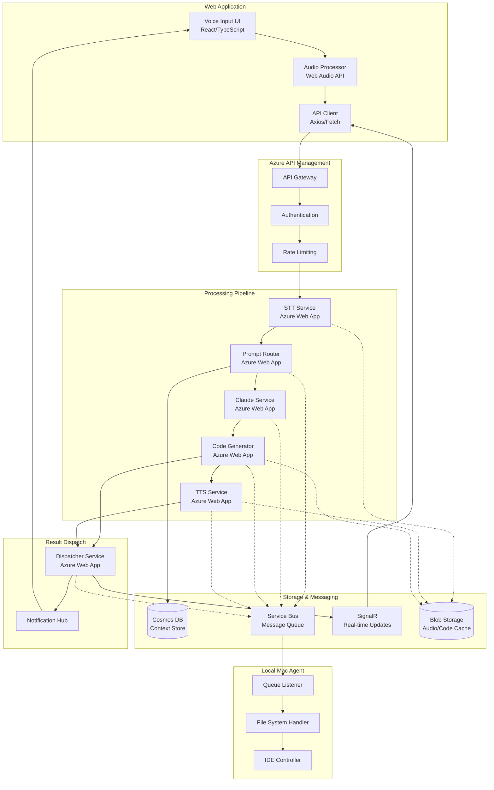

# VoiceCode Architecture

## Overview

VoiceCode is built on a microservice architecture deployed on Microsoft Azure. The system processes voice commands from web browsers, leverages Claude AI for code generation, and delivers results to both the web application and local development environments.

## Architecture Diagram

## Core Components

### 1. Web Application
- **Voice Input UI**: Browser-based push-to-talk or continuous listening interface
- **Audio Processor**: Web Audio API for audio capture and processing
- **API Client**: RESTful API communication with Azure backend

### 2. API Gateway (Azure API Management)
- **Entry Point**: Single endpoint for all client requests
- **Authentication**: OAuth 2.0/Azure AD B2C integration
- **Rate Limiting**: Per-user quotas and throttling
- **Request Routing**: Intelligent routing to backend services
- **CORS**: Cross-origin resource sharing for web app

### 3. Processing Services

#### Speech-to-Text Service
- Azure Speech Services or Whisper API integration
- Audio format normalization
- Language detection and transcription
- Confidence scoring

#### Prompt Router
- Intent classification
- Context retrieval from Cosmos DB
- Prompt template selection
- Token budget management

#### Claude Integration Service
- Anthropic Claude API integration
- Prompt construction and optimization
- Response parsing and validation
- Error handling and retry logic

#### Code Generator
- Code formatting and syntax validation
- File diff generation
- Multi-file change coordination
- Git integration preparation

#### Text-to-Speech Service
- Natural language summarization
- Azure Speech synthesis
- Voice personalization
- Audio compression

### 4. Data Storage

#### Cosmos DB
- User profiles and preferences
- Session context and history
- Prompt templates
- Code snippets cache

#### Azure Blob Storage
- Audio file temporary storage
- Generated code archives
- TTS audio cache
- Large context storage

#### Service Bus
- Asynchronous message queuing
- Reliable message delivery
- Dead letter queue handling
- Message ordering guarantees

### 5. Real-time Communication

#### SignalR Service
- WebSocket connections to web app
- Real-time status updates
- Progressive result streaming
- Connection state management
- Browser compatibility handling

### 6. Local Mac Agent
- Service Bus queue subscription
- File system monitoring and modification
- VS Code/Cursor API integration
- Git operations automation
- Local security sandboxing

## Communication Patterns

### Request Flow
1. **Voice Input** → Web Browser
2. **HTTPS POST** → API Gateway (with CORS)
3. **Async Processing** → Service Bus
4. **Web API Endpoints** → Processing Pipeline
5. **Real-time Updates** → SignalR/WebSocket
6. **Queue Message** → Mac Agent
7. **File System Changes** → Local Repository

### Data Flow Types
- **Synchronous**: Initial request validation and acknowledgment
- **Asynchronous**: Main processing pipeline via Service Bus
- **Real-time**: Status updates and progressive results via SignalR
- **Batch**: Context synchronization and history updates

## Deployment Architecture

### Azure Resources
- **Resource Groups**: Organized by environment (dev/staging/prod)
- **App Service Plans**: Elastic scaling for Web Apps
- **Virtual Networks**: Service isolation and security
- **Azure Monitor**: Comprehensive logging and alerting

### Infrastructure as Code
- Terraform modules for resource provisioning
- Azure Bicep for ARM template management
- GitHub Actions for CI/CD pipelines
- Environment-specific configurations

## High Availability

### Redundancy
- Multi-region deployment capability
- Azure Traffic Manager for geo-routing
- Cosmos DB global distribution
- Service Bus geo-disaster recovery

### Fault Tolerance
- Circuit breaker patterns
- Retry policies with exponential backoff
- Dead letter queue processing
- Graceful degradation strategies

## Performance Optimization

### Caching Strategy
- Redis Cache for session data
- CDN for static assets
- Local caching in Mac agent
- Prompt template preloading

### Scaling Policies
- Web App auto-scaling rules
- Cosmos DB RU auto-scaling
- SignalR unit scaling
- Queue-based load leveling

## Monitoring and Observability

### Application Insights
- End-to-end transaction tracking
- Custom metrics and events
- Performance counters
- Dependency tracking

### Log Analytics
- Centralized log aggregation
- Query-based alerting
- Security event monitoring
- Cost analysis dashboards