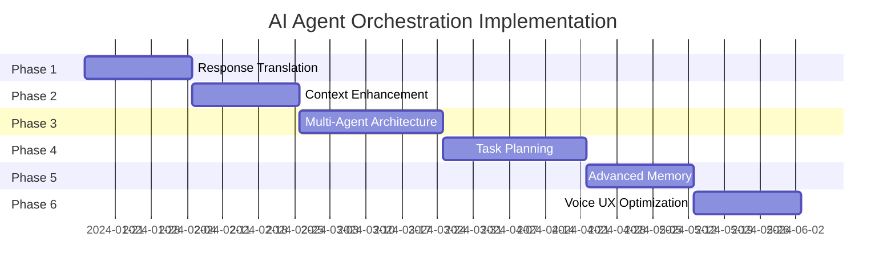

# AI Agent Orchestration Implementation Plan

## Executive Summary

This document outlines a phased approach to transform VoiceCode from a linear voice-to-code pipeline into an intelligent AI Agent orchestration system. The system will act as a middleware layer between voice input and multiple AI agents, translating screen-oriented responses into voice-friendly summaries.

## Current State Analysis

### What We Have
1. **Complete Voice Pipeline**: Voice → STT → Text → Claude → Code → TTS → Voice
2. **Basic Intent Classification**: Router service categorizes requests
3. **Single AI Integration**: Direct Claude API integration
4. **Real-time Communication**: SignalR for live updates
5. **Session Management**: Basic conversation tracking

### What's Missing
1. **Agent Orchestration Layer**: No intelligent middleware to coordinate multiple AI agents
2. **Response Translation**: Screen-oriented outputs not optimized for voice
3. **Context Persistence**: Limited long-term memory and context awareness
4. **Multi-Agent Support**: Only Claude, no agent selection logic
5. **Task Planning**: No decomposition of complex requests
6. **Voice-First UX**: Responses not optimized for audio consumption

## Phased Implementation Approach

### Phase 1: Foundation - Response Translation Layer (2-3 weeks)

**Goal**: Create a middleware service that translates Claude's screen-oriented responses into voice-friendly summaries.

**Components**:
1. **New Orchestrator Service**
   ```
   /services/orchestrator-service/
   ├── Controllers/
   │   └── OrchestrationController.cs
   ├── Services/
   │   ├── ResponseTranslationService.cs
   │   ├── VoiceSummaryService.cs
   │   └── CodeAnalysisService.cs
   ├── Models/
   │   ├── OrchestrationRequest.cs
   │   ├── OrchestrationResponse.cs
   │   └── VoiceSummary.cs
   ```

2. **Response Translation Features**
   - Extract key actions from Claude responses
   - Summarize code changes in natural language
   - Identify important warnings/errors
   - Create confirmation prompts for destructive actions

3. **Integration Points**
   - Modify Router service to forward to Orchestrator
   - Orchestrator calls Claude service
   - Translate response before sending to TTS

**Deliverables**:
- Response translation service
- Voice-optimized summary templates
- Integration with existing pipeline
- Unit tests for translation logic

### Phase 2: Context Enhancement (2-3 weeks)

**Goal**: Implement persistent context management and memory systems.

**Components**:
1. **Memory Services**
   ```
   /services/orchestrator-service/Memory/
   ├── ConversationMemoryService.cs
   ├── ProjectContextService.cs
   ├── SemanticSearchService.cs
   └── MemoryStore/
       ├── IMemoryStore.cs
       └── InMemoryStore.cs (initially)
   ```

2. **Context Features**
   - Track conversation goals and progress
   - Remember project-specific terminology
   - Maintain file modification history
   - Store user preferences and patterns

3. **Enhanced Prompts**
   - Include relevant context in Claude requests
   - Reference previous conversations
   - Maintain consistency across sessions

**Deliverables**:
- Memory management system
- Context injection into prompts
- Session continuity across reconnects
- Basic semantic search

### Phase 3: Multi-Agent Architecture (3-4 weeks)

**Goal**: Transform the system into a true multi-agent architecture with specialized agents.

**Components**:
1. **Agent Framework**
   ```
   /services/orchestrator-service/Agents/
   ├── Core/
   │   ├── IAgent.cs
   │   ├── BaseAgent.cs
   │   └── AgentCapabilities.cs
   ├── Specialized/
   │   ├── CodeGenerationAgent.cs
   │   ├── CodeReviewAgent.cs
   │   ├── RefactoringAgent.cs
   │   ├── DocumentationAgent.cs
   │   ├── TestGenerationAgent.cs
   │   └── ExplanationAgent.cs
   └── Registry/
       └── AgentRegistry.cs
   ```

2. **Agent Selection Logic**
   - Capability-based routing
   - Agent availability checking
   - Load balancing
   - Fallback mechanisms

3. **Agent Communication**
   - Standard message protocols
   - Inter-agent communication
   - Result aggregation

**Deliverables**:
- Agent framework and base classes
- Initial set of specialized agents
- Agent selection algorithm
- Agent registry and discovery

### Phase 4: Intelligent Task Planning (3-4 weeks)

**Goal**: Implement task decomposition and workflow orchestration.

**Components**:
1. **Planning System**
   ```
   /services/orchestrator-service/Planning/
   ├── TaskPlanner.cs
   ├── TaskDecomposer.cs
   ├── WorkflowEngine.cs
   └── PlanExecutor.cs
   ```

2. **Planning Features**
   - Break complex requests into subtasks
   - Identify dependencies between tasks
   - Parallel execution where possible
   - Progress tracking and reporting

3. **Workflow Templates**
   - Common development workflows
   - Customizable task chains
   - Error handling strategies

**Deliverables**:
- Task planning system
- Workflow execution engine
- Progress tracking
- Voice progress updates

### Phase 5: Advanced Memory and Learning (2-3 weeks)

**Goal**: Implement vector-based memory and learning capabilities.

**Components**:
1. **Vector Memory**
   ```
   /services/orchestrator-service/Memory/Advanced/
   ├── VectorMemoryService.cs
   ├── EmbeddingService.cs
   └── SimilaritySearch.cs
   ```

2. **Learning Features**
   - Learn from successful/failed attempts
   - Adapt agent selection based on outcomes
   - Improve response translations over time
   - User preference learning

**Deliverables**:
- Vector database integration
- Embedding generation
- Similarity-based retrieval
- Basic learning mechanisms

### Phase 6: Voice-First UX Optimization (2-3 weeks)

**Goal**: Optimize the entire experience for voice interaction.

**Components**:
1. **Voice UX Service**
   ```
   /services/orchestrator-service/VoiceUX/
   ├── ConversationFlowService.cs
   ├── ConfirmationService.cs
   ├── ProgressNarrationService.cs
   └── ErrorExplanationService.cs
   ```

2. **Voice Features**
   - Natural conversation flows
   - Smart interruption handling
   - Context-aware confirmations
   - Progressive disclosure of information

**Deliverables**:
- Voice-optimized conversation flows
- Interruption handling
- Natural progress updates
- Error explanation system

## Implementation Timeline



## Success Metrics

1. **Phase 1**: 80% reduction in spoken response length while maintaining information completeness
2. **Phase 2**: 90% context retention across conversation sessions
3. **Phase 3**: Support for 5+ specialized agents with <500ms routing time
4. **Phase 4**: Complex tasks decomposed into 3-10 subtasks automatically
5. **Phase 5**: 95% relevant context retrieval accuracy
6. **Phase 6**: 90% user satisfaction with voice interactions

## Risk Mitigation

1. **Backward Compatibility**: Each phase maintains existing functionality
2. **Incremental Rollout**: Feature flags for gradual enablement
3. **Fallback Mechanisms**: Direct Claude access if orchestration fails
4. **Performance Monitoring**: Metrics at each layer
5. **User Feedback Loop**: Regular testing with voice users

## Next Steps

1. Begin Phase 1 implementation with ResponseTranslationService
2. Set up orchestrator service project structure
3. Create integration tests for existing pipeline
4. Design voice-friendly response templates
5. Implement basic Claude response parsing

This phased approach allows for incremental value delivery while building toward a sophisticated AI agent orchestration system optimized for voice-driven development.